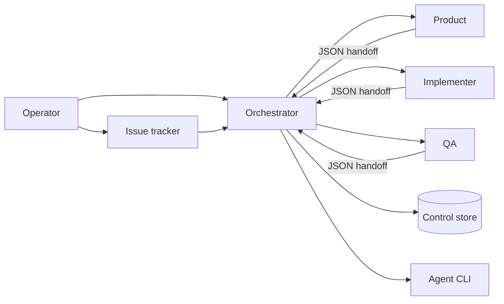

# agent-pipeline

A verifiable development workflow for coding agents, independent of any agent vendor.

[Lire en français](README.fr.md)

[](https://nodejs.org/)
[](#requirements)
[](LICENSE)

agent-pipeline turns multi-agent development into a bounded, observable workflow: separate roles, durable state, frozen criteria, executable quality gates, and evidence tied to commits.

> If an important rule cannot fail in a command, it is advice.


## What it addresses

| Common risk | Pipeline response |
| --- | --- |
| Agents overwrite each other's work | file reservations and overlap detection |
| Scope grows during implementation | frozen criteria, parked findings, approved expansion only |
| “Done” is subjective | controlled transitions, gates, and SHA-bound evidence |
| Multiple roles mutate shared state | single-writer control store with optimistic locking |
| Agents run silently | NDJSON events, heartbeat, local dashboard, interruption |
| Validation costs too much | risk lanes and explicit closure gates |



Product defines the contract, Implementer writes tests and code, QA validates without writing, and Orchestrator owns transitions and persistence.

## Install

### Automatic setup for an existing Nest project

From the root of a project created with `nest new`, with dependencies installed, Git, Sudocode and this development checkout at `agent-pipeline/`:

```sh
node agent-pipeline/scripts/setup.mjs --runtime claude-code
```

The command detects existing tools, installs the supplied profile, generates configuration and role instructions, initializes the tracker, installs hooks and runs the actual checks. Application sources, package scripts and dependencies are preserved. No agent needs to compose installation files.

Use `--dry-run` to preview without writing. Installed versions must match the [compatibility manifest](profile-bundles/nest/compatibility.json), currently validated for Nest 11 with Node 24, npm 11, Jest 30 and ESLint 9. Monorepos and unvalidated combinations require adaptation. `pipeline/setup-report.json` records steps and durations.

For installed adapters, `setup.mjs --update` previews changes and `setup.mjs --update --apply` applies and verifies them while retaining independent local adaptations. CI checks the declared contract and probes the latest published CLI weekly. See [the Nest setup guide and limits](profile-bundles/nest/README.md).

This command is new in the development checkout and is not included in the `v0.1.0` release below. The following bootstrap remains the manual path for other stacks.

### 1. Pin a release

An updatable installation keeps provenance through a Git submodule pinned to a release tag:

```sh
git submodule add https://github.com/HerbertCodex/agent-pipeline.git agent-pipeline
git -C agent-pipeline checkout v0.1.0
git add .gitmodules agent-pipeline
```

See [release and update policy](docs/releases.md). Removing the nested `.git` without recording a version is not recommended.

### 2. Record bootstrap decisions

```sh
node agent-pipeline/scripts/init.mjs
```

The command asks only what source inspection cannot prove: product, constraints, whether the stack is imposed, project type, and approved architecture. It writes an auditable bootstrap record, decision entry, and intentionally incomplete configuration. The stack-specific installer then inspects real manifests and source before completing and calibrating the profile.

For non-interactive automation, use `--answers <answers.json>`. Continue with the complete [new-project installation guide](docs/nouveau-profil.md).

To reuse an existing stack profile, run `import-profile.mjs <bundle-dir>` after `init.mjs`: it completes the untouched bootstrap configuration while preserving your decisions. The shipped TypeScript profile is a contract to adapt, not a ready-to-run toolchain. First-time installation still includes tooling setup and calibration.

For a Nest presentation, prepare the host project, its dependencies and Sudocode, then demonstrate `setup.mjs` itself. Diagnose checks in an existing installation with `preflight.mjs --timeout-seconds 60`, which reports progress and durations with a per-command timeout. See [installation cost and live demonstrations](docs/nouveau-profil.md#installation-cost-and-live-demonstrations).

### Requirements

- Node.js 20 or later;
- Git;
- a host repository;
- [Sudocode](https://github.com/sudocode-ai/sudocode) for the complete tracker workflow, or authenticated `gh` for the minimal GitHub Issues adapter;
- an agent CLI only when automatic dispatch is used.

The core has no production npm dependency.

## Daily use

```sh
# Inspect runnable work
node agent-pipeline/scripts/next-step.mjs
node agent-pipeline/scripts/next-issues.mjs

# Dispatch a role
node agent-pipeline/scripts/dispatch.mjs <issue-id> product
node agent-pipeline/scripts/dispatch.mjs <issue-id> implementer
node agent-pipeline/scripts/dispatch.mjs <issue-id> qa

# Project and verify tracker status
node agent-pipeline/scripts/tracker-sync.mjs --apply
node agent-pipeline/scripts/tracker-sync.mjs
```

Run the local dashboard with `node agent-pipeline/dashboard/server.mjs`, then open `http://127.0.0.1:4399`. It consumes the same scheduler state and does not create another source of truth. Docker and security details are in [dashboard/README.md](dashboard/README.md).

## Tracker adapters

Sudocode is the complete adapter: issues, specs, relationships, idempotent creation, local UI, and status projection. Its files remain separate from the pipeline control store.

The minimal GitHub Issues adapter reads labelled work through `gh`, distinguishes specs by a configured label, and projects pipeline phases through status labels. It intentionally refuses automated creation and relationships: GitHub Issues does not expose the same portable relationship contract, and the core does not emulate one silently. Its exact configuration is in the [installation guide](docs/nouveau-profil.md#7-configure-the-tracker-and-seed-the-control-store).

## Security boundary

`file_policy` is enforced only when the agent platform applies per-role filesystem permissions. Without that platform boundary, agent-pipeline provides **detection, not prevention**: `verify-scope` compares the committed diff with reservations and policy after a role returns, then refuses the transition.

`permissions.mjs` derives globally enforceable denials and can check a platform settings file. True per-role prevention requires separate platform identities or sandboxes. A prompt prohibition is never presented as a security boundary.

## Stack-neutral quality

Profiles bind stable gate names to real tools for the host stack: types, lint, tests, audit, secrets, architecture, duplication, design limits, and a generated project map. The [frontend TypeScript bundle](profile-bundles/frontend-typescript) is an example to recalibrate, not an imposed stack.

Relational projects may declare `data_model`: persistence decision, physical schema, migrations, per-issue integration proof, 3NF by default, and an explicit UTC policy for `created_at` and `updated_at`. An offline UML review page can be generated with:

```sh
node agent-pipeline/scripts/render-data-model.mjs docs/data-model.diagram.json data-model.html
```

## Guarantees and limits

The pipeline makes decisions, evidence, transitions, and exceptions visible and testable. It does not choose the product, architecture, or dependencies; replace human review; turn prompts into permissions; or make a non-interactive CLI interactive.

## Documentation

| Guide | Purpose |
| --- | --- |
| [New project](docs/nouveau-profil.md) | installation and stack adaptation |
| [Operator manual](docs/operateur.md) | operation and human decisions |
| [State machine](docs/state-machine.md) | phases, roles, transitions |
| [Handoffs and store](docs/handoff-store.md) | persistence and evidence protocol |
| [Quality gates](docs/quality-gates.md) | executable rules |
| [Releases](docs/releases.md) | versioning and updates |

## Development

```sh
node --test test/*.test.mjs
```

Changes to prompts, scripts, configuration, rules, or profiles require human review.

## License

[MIT](LICENSE)
