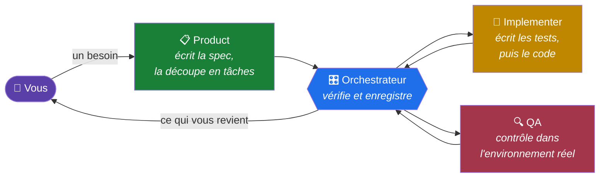
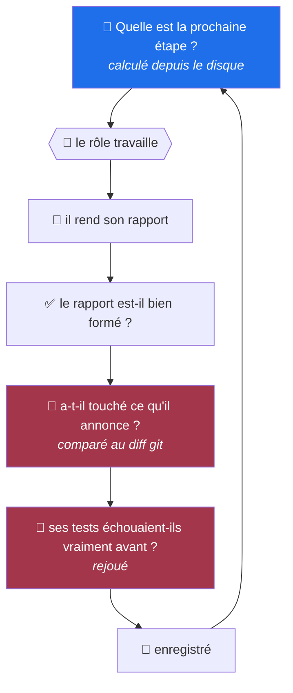
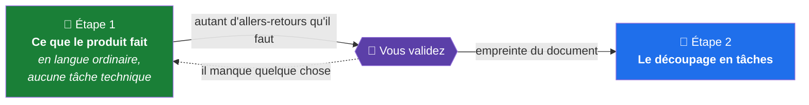

<div align="center">

# no-name-driven

**Vous faites écrire du code par des agents IA.
Ce framework vérifie ce qu'ils ont fait, au lieu de les croire sur parole.**

`Node` · `aucune dépendance` · `toutes stacks` · `MIT`

</div>

---

## 😤 Le problème, concrètement

Vous demandez à un agent d'implémenter une fonctionnalité. Il vous répond :

> *« C'est fait. Tests écrits et passants, couverture à 94 %, les cinq critères sont validés. »*

Trois questions auxquelles vous ne pouvez pas répondre sans tout relire :

- **A-t-il vraiment lancé les tests ?** Il dit oui. Vous n'avez que sa parole.
- **Ces tests vérifient-ils quelque chose ?** Un test qui appelle une fonction sans rien contrôler passe, et compte dans les 94 %.
- **A-t-il touché des fichiers qu'il ne devait pas ?** Le diff fait 400 lignes.

Alors vous relisez tout. Et vous perdez le temps que l'agent vous avait fait gagner.

**Pire : quand plusieurs agents se relaient.** Le premier affirme. Le deuxième reprend l'affirmation comme un fait acquis et construit dessus. Le troisième hérite des deux. Personne n'a menti, personne n'a vérifié, et l'erreur est à trois étages de profondeur quand vous la trouvez.

---

## 💡 Ce que fait ce framework

Il coupe le travail en quatre rôles qui **ne se font pas confiance**, et il vérifie mécaniquement à chaque passage de relais.

Un exemple réel. L'agent qui code affirme n'avoir touché que 8 fichiers. Le framework ne le croit pas — il compare avec `git` :

```console
$ node agent-pipeline/scripts/verify-scope.mjs handoff.json abc1234
scope verifie : 8 fichier(s), abc1234..def5678, role implementer, 2026-08-18T09:14:22.031Z
```

Et quand la déclaration ne tient pas :

```console
$ node agent-pipeline/scripts/verify-scope.mjs handoff.json abc1234
scope : modifie mais non declare : package.json
scope : hors role implementer : package.json
```

Ici l'agent a modifié un fichier qu'il n'a pas mentionné, **et** ce fichier ne fait pas partie de ce qu'il a le droit de toucher. Le travail est refusé. Personne n'a eu à relire 400 lignes de diff.

Deuxième exemple. L'agent dit avoir écrit ses tests **avant** le code. Le framework revient au commit de test, relance la suite, et exige qu'elle échoue :

```console
$ npx jest --runInBand
Tests: 5 failed, 18 passed          ← rouge observé, pas déclaré
```

Si la suite passe au vert à ce commit-là, les tests ont été écrits après. Le travail est refusé.

**C'est tout le principe** : ce qui est enregistré, c'est ce qui a été mesuré. Jamais ce qui a été annoncé.

---

## 📖 Quatre mots à connaître

| Mot | Ce que ça veut dire ici |
| :-- | :-- |
| **une commande** | déclarée dans la configuration : `npm test`, `eslint`, un scan de secrets. Elle passe ou elle échoue. Si elle échoue, le travail ne passe pas. C'est tout. |
| **un rôle** | un agent avec un seul métier et des droits limités. Celui qui code ne peut pas modifier la configuration. Celui qui vérifie ne peut rien écrire du tout. |
| **un handoff** | le rapport qu'un rôle rend en terminant. Un fichier JSON, validé avant d'être accepté. |
| **le store** | deux fichiers sur disque où vit l'état d'avancement. Pas dans la mémoire d'un agent : si la session s'arrête, rien n'est perdu. |

---

## 🧭 Comment les quatre rôles travaillent



**Chaque rôle a des droits limités**, et ce n'est pas une consigne polie dans un prompt : c'est refusé automatiquement.

| Rôle | Peut écrire | Ne peut pas |
| :-- | :-- | :-- |
| 📋 Product | rien dans le code | ni code, ni tests |
| 🔨 Implementer | le code et les tests | ni la config, ni les commandes |
| 🔍 QA | **rien du tout** | lecture seule, elle ne corrige jamais |
| 🎛️ Orchestrateur | l'état d'avancement | ni code, ni tests |

Pourquoi QA ne corrige rien : si celui qui vérifie peut aussi réparer, il répare au lieu de signaler, et vous ne saurez jamais combien de fois c'est arrivé.

---

## 🔍 Ce qui est vérifié à chaque passage de relais



Les deux étapes en rouge sont celles qui distinguent ce framework d'un simple enchaînement de prompts. **Elles ne demandent rien à l'agent : elles mesurent.**

Et l'orchestrateur ne fait **qu'une étape à la fois**, puis s'arrête. Il relit l'état sur le disque à chaque fois. Coupez la session au milieu : rien n'est perdu, l'étape suivante se recalcule.

---

## 🎯 Ce qui le distingue des autres frameworks d'agents

Il en existe beaucoup qui orchestrent des agents. La différence n'est pas là.

| La plupart proposent | Ici |
| :-- | :-- |
| des phases (plan → code → review) | les phases **existent aussi**, mais chacune est vérifiée par une commande |
| des rôles décrits dans des prompts | des rôles dont les droits sont **refusés par la plateforme**, pas demandés poliment |
| « l'agent doit écrire les tests d'abord » | on **remonte au commit de test et on relance la suite** |
| un rapport de l'agent | un rapport **confronté au `git diff`** avant d'être accepté |
| de la mémoire dans le contexte | deux fichiers sur disque, avec verrou anti-écrasement |

Et une règle qui s'applique au framework lui-même :

> **Si une règle n'a pas de commande qui la fait échouer, elle n'existe pas.**
>
> Exemple vécu : la documentation affirmait qu'un certain contrôle refusait les transitions invalides. En allant vérifier, le contrôle n'existait pas dans le code. Personne n'échouait, personne ne signalait, et la règle n'avait jamais lieu depuis le début.
>
> C'est pour ça que ce dépôt a **132 tests sur son propre code** : le code qui décide si votre code est vérifié n'était vérifié par personne.

---

## 🚀 Démarrer un projet

### 1️⃣ Poser le framework

```bash
cd mon-projet
git clone https://github.com/HerbertCodex/no-name-driven.git agent-pipeline
rm -rf agent-pipeline/.git
```

> ⚠️ Le dossier **doit** s'appeler `agent-pipeline/`.

### 2️⃣ Décrire votre produit, avant toute technique

Votre session vous pose huit questions en langue ordinaire. Deux comptent vraiment :

> **Y a-t-il des cas où le système doit *refuser* quelque chose ?**
> Pas « ce champ est obligatoire ». Un vrai refus : *« ce livre est déjà emprunté »*, *« ce compte n'a pas assez »*.
>
> **Un professionnel du métier comprendrait-il ce refus sans qu'on parle informatique ?**

Ça détermine si votre produit a de vraies règles métier à protéger, ou seulement des données à ranger. Un logiciel qui ne refuse jamais rien pour une raison venue du monde réel n'a pas de métier.

### 3️⃣ Choisir comment ranger le code

```bash
node agent-pipeline/scripts/render-architecture.mjs archi.html backend
```

Ça produit une page HTML qui explique les options — un dossier par fonctionnalité, en couches, hexagonale, Clean — avec pour chacune :

- **une phrase en clair**, sans jargon ;
- **l'arborescence réelle** des dossiers ;
- **combien de fichiers** il faut écrire pour ajouter une route (3 avec l'une, 6 avec l'autre) ;
- **les signes concrets** qui diront un jour qu'il faut en changer.

Le framework **ne choisit pas à votre place**. Et il vous met en garde contre l'erreur la plus fréquente : prendre l'architecture la plus lourde par précaution, c'est payer une assurance qu'on n'utilisera peut-être jamais — prélevée sur chaque fichier écrit, pendant des années.

### 🎨 Si le projet a des écrans

```bash
node agent-pipeline/scripts/render-design-system.mjs design.html frontend
```

La page pose **un ordre**, et l'ordre est tout son contenu : jetons → primitives → composants de produit → écrans.

> 🎯 **« On fait la maquette d'abord ? »** Une maquette d'exploration, oui, tout de suite. LA maquette finie, non : dessinée avant les jetons, elle invente une échelle — des espacements choisis à l'œil, six gris presque identiques — et le code la recopie faute d'autre référence. Vous n'avez alors pas un design system, vous avez une maquette transcrite.

Elle pèse aussi le choix qui revient partout — écrire ses primitives, prendre une bibliothèque sans style, prendre une bibliothèque complète — avec **l'accessibilité comme critère qui tranche**. Une bibliothèque qui ne gère ni le focus, ni le clavier, ni les annonces de lecteur d'écran n'est pas une bibliothèque de composants : c'est un jeu de styles.

`apply-profile` refuse un projet frontend, mobile ou fullstack sans bloc `design_system`. Un back-end n'est jamais interrogé.

### 📦 Avant d'installer quoi que ce soit

Aucun agent n'installe. Il **argumente et s'arrête** :

```bash
node agent-pipeline/scripts/render-dependency.mjs evaluation.json page.html
```

La page porte, pour chaque candidat : licence, poids transitif, date de dernière publication, **avis de sécurité ouverts**, privilèges d'exécution — et ce que coûterait de l'écrire à la main, pour que refuser soit un choix informé. `validate-handoff` refuse une demande à qui il manque une de ces mesures : elles ne se remplissent pas sans avoir regardé.

### ♻️ Si un projet de la même stack tourne déjà

Ne réécrivez pas ses commandes. Exportez-les :

```bash
node agent-pipeline/scripts/export-profile.mjs mon-profil/ eslint.config.mjs knip.json
node agent-pipeline/scripts/import-profile.mjs mon-profil/ .    # dans le nouveau dépôt
```

Le paquet emporte les **commandes, les politiques et les fichiers d'outils** — pas l'endroit où l'autre projet range son état, ni sa forge, ni l'architecture qu'il a choisie.

> ⚠️ **Il n'est pas utilisable tel quel.** `apply-profile` refuse tant que `calibration_required` vaut `true`. Les seuils ont été mesurés sur un *autre* code : trop larges, la commande ne refuse plus rien ; trop serrés, la première exécution les fait desserrer. Mesurez-les chez vous, puis passez le drapeau à `false` — c'est une affirmation, pas une case à cocher.

### 4️⃣ Laisser un agent l'installer

Donnez-lui ceci, en remplaçant `<votre stack>` :

```text
Ce dépôt contient un framework d'agents dans agent-pipeline/. Il n'est pas
encore configuré pour ce projet, qui est en <votre stack>.

J'ai choisi le rangement du code à l'étape précédente : <id vu sur la page>,
pour un projet de type <backend|frontend|mobile|fullstack>. Déclare-le dans
le bloc architecture de pipeline.config.json et range le code comme ça.

Lis agent-pipeline/docs/nouveau-profil.md et suis-le du début à la fin.

Ne me rends la main qu'après avoir répondu aux sept questions du contrôle
final — chacune par une commande et sa sortie réelle, pas par un avis.

Deux choses restent à moi : installer une dépendance, et modifier la
configuration une fois le pipeline en service. Demande-les moi.
```

> 🔒 **Le choix de l'étape 3 n'est pas qu'une indication.** Il est écrit dans la configuration, et `apply-profile` refuse de démarrer sans lui — comme il refuse un rangement qui ne vaut pas pour votre type de projet. Sans ça, le choix ne vivrait que dans une page HTML : l'agent qui installe rangerait à sa façon, le suivant autrement, et personne ne pourrait dire qu'il y a dérive puisque rien ne dirait de quoi ça dérive.

### 5️⃣ Vérifier avant de croire

```console
$ node agent-pipeline/scripts/preflight.mjs
  ok    check
  ok    lint
  ABSENT secrets_scan    /bin/sh: gitleaks: command not found
```

Une commande dont l'outil n'est pas installé **échoue au lieu de protéger** — et une commande toujours rouge finit par être ignorée. `preflight` distingue « cette commande a trouvé un problème » de « cette commande ne peut pas tourner ».

Puis la question qui compte le plus :

> ⭐ **Avez-vous vu chaque commande échouer au moins une fois ?**
>
> Cassez volontairement ce qu'elle est censée attraper. Une commande qui passe sur du code sain ne prouve rien — elle peut passer parce qu'elle ne mesure rien. Ça s'est produit trois fois sur ce dépôt en une journée.

---

## ✍️ Écrire une spec avec vous, pas à votre place



**Pourquoi deux étapes.** Sans ça, l'agent écrit 70 Ko de tâches détaillées avant que quiconque ait confirmé qu'il a compris le produit. Quand vous découvrez l'erreur, tout est à refaire.

À l'étape 1, il vous soumet **chaque choix que vous pourriez faire autrement** — la durée d'un prêt, faut-il valider le format d'un email, que se passe-t-il si on rend deux fois le même livre. Avec sa recommandation et les autres options.

La page n'est pas une politesse : `render-proposal` y grave l'empreinte de ce qu'elle affiche, et `validate-handoff` **refuse un tour qui n'en déclare aucune** — ou dont la page a été rendue avant que le périmètre bouge. Si vous n'avez jamais reçu de page, aucun tour n'a été soumis.

Quand vous validez, le document est **figé par une empreinte**. Si le découpage de l'étape 2 s'appuie sur autre chose, ou sur ce document modifié après coup, il est refusé. On ne peut pas vous faire approuver 14 jours et en programmer 30.

---

## 🛠️ Au quotidien

```bash
node agent-pipeline/scripts/next-step.mjs        # 📍 quelle est la prochaine étape ?
node agent-pipeline/scripts/render-decisions.mjs q.html  # ⚖️ qu'est-ce qui attend ma décision ?
node agent-pipeline/scripts/preflight.mjs        # 🚦 mes commandes tournent-elles vraiment ?
node agent-pipeline/scripts/metrics.mjs          # 📊 combien de défauts sont passés ?
node agent-pipeline/scripts/status.mjs           # 👁️ où en est-on ?
```

⚖️ **`render-decisions`** est calculée depuis l'état réel, pas rédigée. Une tâche qu'aucun agent n'a le droit de prendre y apparaît **même si personne ne l'a signalée**.

---

## 🧬 La commande qui empêche l'agent de réécrire la même chose

Chaque prompt exige une **note de réutilisation** pour toute création. Jusqu'ici elle était jugée en revue — donc quand quelqu'un pensait à regarder. Sur deux cents petits composants, personne ne regarde.

```console
$ npm run duplication
11 lines repeated in 2 places:
  test/catalog.e2e-spec.ts:22
  test/health.e2e-spec.ts:19
```

Le framework fournit le détecteur, sans aucune dépendance, pour qu'aucun projet n'attende un outil. Pointez la clé sur `jscpd` ou `pmd cpd` quand vous voulez une analyse par jetons.

> 💡 **Attendez-vous à ce qu'elle soit rouge au premier lancement**, et lisez avant de toucher au seuil. Sur ce dépôt elle a trouvé trois vraies copies dès le premier jour — dont tout l'amorçage e2e recopié dans trois suites, alors que la carte du projet annonçait ces harnais comme réutilisables.

## 🗺️ La carte du projet, fournie sans connaître votre langage

```console
$ node agent-pipeline/scripts/project-map.mjs
written: docs/project-map.md (23 file(s), 40 declaration(s))
  5 file(s) with no recognised declaration — the map lists them and says so.
```

Elle répond à **« est-ce que ça existe déjà ? »** — la question que la note de réutilisation oblige à poser, et que la commande de duplication fait respecter.

Le générateur reconnaît les déclarations **par motif**, sans analyser aucune syntaxe : `export function`, `export class`, `pub fn`, `def`, `func`. Il marche sur du React, du Python, du Go, du Rust.

> ⚠️ **Il est volontairement plus faible qu'un vrai analyseur**, et la carte le dit d'elle-même. Pointez `commands.project_map` sur un générateur qui parse votre langage le jour où vous voulez les rôles et les routes dedans.

Ses deux refus sont le cœur : **aucun fichier trouvé**, et **aucune déclaration reconnue**. C'est exactement ce qu'une carte vide masque — un générateur écrit pour une autre stack rend un document quasi vide, `--check` compare vide à vide, et sort en 0.

## 🔑 Trois décisions ne partent jamais à un agent

| | Pourquoi |
| :-- | :-- |
| 📦 **Installer une dépendance** | un agent qui peut ajouter une bibliothèque peut contourner n'importe quelle règle en important quelque chose qui la contourne |
| ⚙️ **Modifier la configuration** | c'est le fichier qui définit les commandes. Qui peut les redéfinir peut les faire passer |
| 🔀 **Merger** | QA valide une tâche à la fois ; elle ne garantit pas que l'ensemble tient debout |

---

## 📦 Ce qu'il y a dedans

| | |
| :-- | :-- |
| `scripts/` | 25 scripts Node, **sans aucune dépendance à installer** |
| `prompts/` | les quatre rôles |
| `docs/` | **en anglais** — les modèles suivent mieux l'anglais. `nouveau-profil.md` pour installer, `operateur.md` pour vous |
| `templates/` | les fichiers de politique, le workflow CI |
| `skills/` | conseils de code, indépendants de toute stack |
| `test/` | **215 tests** sur le framework lui-même |

**Prérequis** : Node, git, et le client de votre forge (`gh`, `glab`). Rien d'autre.

🛡️ Un test automatique empêche ce dépôt de dépendre d'une stack : aucun script n'appelle `npm`, aucun n'importe un paquet, aucun ne suppose un chemin que vous pourriez déplacer. Il se copie tel quel dans un projet Python, Go ou Rust.

---

## ⚠️ Ce qu'il ne fait pas

Écrit ici plutôt que découvert par vous.

- **Aucune mesure comparative.** Ce framework compte ses propres défauts échappés. Il ne prouve pas encore qu'il fait mieux qu'une session sans lui.
- **Ouvert-fermé et Liskov ne sont vérifiés qu'en partie.** Deux formes sont attrapées par une commande — une méthode de classe dérivée qui lève inconditionnellement, une chaîne d'`instanceof` qui décide du comportement. Une précondition resserrée, elle, reste invisible à toute requête syntaxique : ça reste en revue humaine, et c'est écrit plutôt que sous-entendu.

---

## 📄 Licence

MIT — voir [`LICENSE`](LICENSE). Copier `agent-pipeline/` dans un projet privé, commercial ou non, est l'usage prévu.
