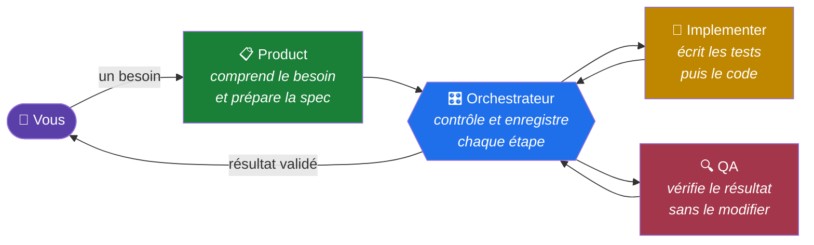
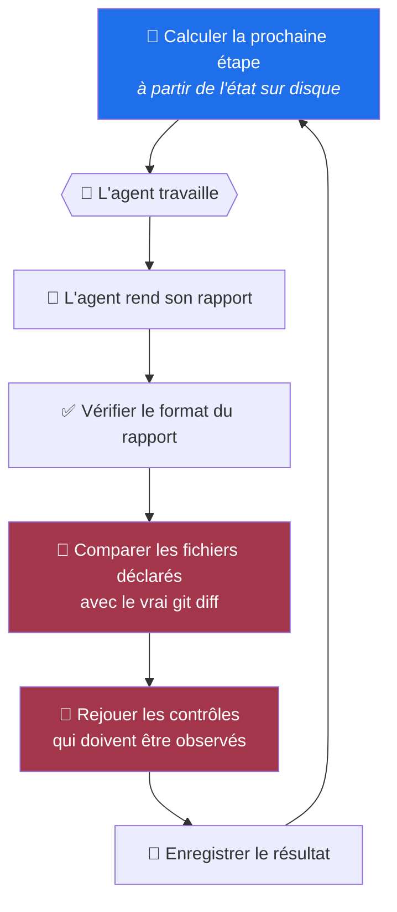
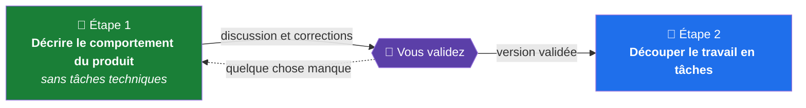

# no-name-driven

**Vous utilisez des agents IA pour écrire du code.
`no-name-driven` vérifie ce qu’ils ont réellement fait au lieu de simplement croire leur compte rendu.**

`Node` · `aucune dépendance` · `toutes stacks` · `MIT`

---

## 😤 Le problème

Vous demandez à un agent IA d’implémenter une fonctionnalité.

Quelques minutes plus tard, il vous répond :

> « C’est fait. Les tests passent, la couverture est à 94 % et tous les critères sont validés. »

Le problème, c’est que vous ne savez pas si ces affirmations sont vraies.

Pour le savoir, vous devez vous-même vérifier :

* est-ce que les tests ont réellement été exécutés ?
* est-ce qu’ils vérifient vraiment quelque chose ?
* est-ce que l’agent a uniquement modifié les fichiers prévus ?
* est-ce que les règles du projet ont réellement été respectées ?

Un test peut très bien passer sans vérifier le moindre résultat.
Un agent peut oublier de mentionner un fichier qu’il a modifié.
Et une règle écrite dans un prompt peut être ignorée sans que personne ne s’en rende compte.

Résultat : vous finissez par relire tout le diff.

Vous perdez alors une partie du temps que l’agent devait justement vous faire gagner.

Le problème devient encore plus important lorsque plusieurs agents travaillent les uns après les autres.

Le premier écrit par exemple :

> « Les tests sont corrects. »

Le deuxième considère cette information comme vraie et continue à partir de là.

Puis le troisième fait la même chose.

Personne n’a forcément menti. Mais personne n’a vérifié non plus.

Une erreur peut donc être transmise d’agent en agent jusqu’à devenir difficile à retrouver.

---

## 💡 L’idée de no-name-driven

Le principe du framework est simple :

**une affirmation d’un agent n’est jamais considérée comme une preuve lorsqu’elle peut être vérifiée automatiquement.**

Si un agent affirme :

> « J’ai modifié huit fichiers. »

le framework regarde directement ce que dit Git.

```console
$ node agent-pipeline/scripts/verify-scope.mjs handoff.json abc1234
scope verifie : 8 fichier(s), abc1234..def5678, role implementer, 2026-08-18T09:14:22.031Z
```

Si l’agent a oublié de déclarer un fichier :

```console
$ node agent-pipeline/scripts/verify-scope.mjs handoff.json abc1234
scope : modifie mais non declare : package.json
scope : hors role implementer : package.json
```

Le framework constate ici deux choses :

1. `package.json` a été modifié mais n’a pas été déclaré ;
2. le rôle qui travaillait n’avait de toute façon pas le droit de modifier ce fichier.

Le résultat n’est donc pas accepté.

Même principe pour les tests.

Si l’agent affirme avoir écrit les tests avant le code, le framework revient au commit correspondant aux tests et relance réellement la suite :

```console
$ npx jest --runInBand
Tests: 5 failed, 18 passed
```

C’est exactement ce qu’on veut observer à ce moment-là : les nouveaux tests doivent échouer puisque le code qui les fait passer n’existe pas encore.

S’ils passent déjà, quelque chose ne correspond pas au processus annoncé.

**Le framework enregistre donc ce qu’il peut observer, pas simplement ce que l’agent raconte.**

---

## 📖 Quatre notions à connaître

Avant d’aller plus loin, voici les quelques termes utilisés dans le reste du projet.

| Terme                    | Signification                                                                                                                                          |
| :----------------------- | :----------------------------------------------------------------------------------------------------------------------------------------------------- |
| **Commande de contrôle** | Une commande définie dans la configuration du projet : tests, lint, scan de secrets, etc. Si elle échoue, l’étape ne peut pas être validée.            |
| **Rôle**                 | Un agent chargé d’un type de travail précis, avec des permissions limitées.                                                                            |
| **Handoff**              | Le rapport structuré qu’un agent remet lorsqu’il termine son étape. C’est un fichier JSON que le framework vérifie avant de l’accepter.                |
| **État du pipeline**     | Les fichiers enregistrés sur disque qui indiquent où en est le travail. L’avancement ne dépend donc pas de la mémoire de la conversation avec l’agent. |

---

## 🧭 Comment le travail est organisé

Le pipeline utilise quatre rôles.



Chaque rôle a une responsabilité précise.

### 📋 Product

Il transforme votre besoin en spécification puis en tâches.

Il ne touche pas au code.

### 🔨 Implementer

Il écrit les tests puis le code nécessaire pour les faire passer.

Il ne peut pas modifier les règles du pipeline pour faciliter son propre travail.

### 🔍 QA

Il contrôle le résultat dans l’environnement réel.

Il travaille en lecture seule : **QA signale les problèmes, mais ne les corrige pas.**

Ce choix est volontaire.

Si QA corrige elle-même ce qu’elle découvre, l’Implementer ne reçoit jamais réellement le retour. Le problème disparaît dans cette tâche, mais la même erreur risque d’être reproduite dans la suivante.

### 🎛️ Orchestrateur

Il décide quelle étape peut être exécutée ensuite, vérifie les résultats et enregistre l’avancement.

Il n’écrit ni code ni tests.

---

### Les permissions ne reposent pas uniquement sur les prompts

Le framework ne se contente pas d’écrire :

> « S’il te plaît, ne touche pas à la configuration. »

Il vérifie ce que chaque rôle a réellement modifié et refuse les modifications qui sortent de son périmètre.

| Rôle              | Peut modifier      | Ne peut pas modifier                   |
| :---------------- | :----------------- | :------------------------------------- |
| 📋 Product        | la spécification   | code et tests                          |
| 🔨 Implementer    | code et tests      | configuration et commandes du pipeline |
| 🔍 QA             | rien               | tout est en lecture seule              |
| 🎛️ Orchestrateur | l’état du pipeline | code et tests                          |

---

## 🔍 Ce qui est vérifié entre deux agents

À chaque étape, le fonctionnement est toujours le même.



Deux contrôles sont particulièrement importants.

### 1. Vérifier ce qui a réellement été modifié

Le framework compare la déclaration de l’agent avec le `git diff`.

Un fichier oublié dans le rapport ou modifié hors du périmètre autorisé est donc détecté automatiquement.

### 2. Rejouer les preuves importantes

Certaines règles ne peuvent pas être vérifiées uniquement en regardant le résultat final.

Par exemple :

> « Les tests ont été écrits avant le code. »

Pour vérifier cette affirmation, le framework revient au commit correspondant et exécute réellement les tests.

Le principe est toujours le même :

**quand quelque chose peut être mesuré, le framework préfère la mesure à la déclaration de l’agent.**

---

## 💾 Une session peut s’arrêter sans perdre l’avancement

L’orchestrateur n’essaie pas d’exécuter tout le projet d’un seul coup.

Il effectue une étape, enregistre le résultat sur disque, puis s’arrête.

Lors du passage suivant, il relit cet état et recalcule ce qui doit être fait.

Vous pouvez donc interrompre une session au milieu du travail.

L’étape suivante n’est pas conservée uniquement dans la mémoire d’un modèle : elle est recalculée à partir de l’état enregistré.

---

## 🎯 Ce qui différencie ce framework d’un simple workflow d’agents

Il existe déjà de nombreux systèmes capables d’enchaîner plusieurs agents.

Ce n’est pas la partie originale ici.

La différence se trouve dans la manière dont les règles sont vérifiées.

| Approche courante                        | no-name-driven                                                                   |
| :--------------------------------------- | :------------------------------------------------------------------------------- |
| plan → code → review                     | les mêmes étapes existent, mais elles sont accompagnées de contrôles exécutables |
| rôles décrits dans des prompts           | les modifications de chaque rôle sont vérifiées                                  |
| « écris les tests avant le code »        | le framework revient au commit correspondant et exécute réellement les tests     |
| rapport rédigé par l’agent               | le rapport est comparé avec le véritable `git diff`                              |
| état conservé dans le contexte du modèle | état enregistré sur disque                                                       |

La règle générale du projet est donc :

> **Une règle importante doit pouvoir provoquer un échec vérifiable.**

Autrement dit, écrire une règle dans la documentation ne suffit pas.

Si rien dans le système ne détecte sa violation, il est très facile de croire qu’elle est appliquée alors qu’elle ne l’est pas.

Ce problème s’est d’ailleurs produit dans le framework lui-même : une vérification était décrite dans la documentation, mais n’existait pas réellement dans le code.

C’est précisément pour cette raison que le framework possède également sa propre suite de tests.

---

# 🚀 Installer le framework dans un projet

## Le chemin complet, en un coup d'œil

Cinq étapes. Les trois premières sont à vous, la quatrième à un agent, la cinquième à vous de nouveau.

```text
1. cloner                    → 2 commandes
2. décrire le produit        → 8 questions en langue ordinaire
3. choisir un rangement      → une page HTML à lire, une décision à prendre
   ├─ projet à écrans ?      → + une page design system
   └─ besoin d'une lib ?     → le pipeline argumente, vous installez
4. faire configurer          → un agent écrit la config, les invariants, les pièges
5. vérifier                  → avez-vous vu chaque commande échouer ?
```

Entre les étapes 3 et 4 se trouvent trois sections de référence — design system, dépendances, réutilisation d'un profil existant. **Elles ne sont pas des étapes** : lisez celle qui vous concerne, sautez les autres.

> ⚠️ **Entre l'étape 1 et l'étape 4, presque rien ne marche, et c'est normal.**
>
> ```console
> $ node agent-pipeline/scripts/preflight.mjs
> not found: pipeline.config.json (run it from the project root)
> ```
>
> Les scripts lisent une configuration qui n'existe pas encore. Seul `render-architecture` fonctionne dès le clone, parce qu'il sert justement à prendre la décision qui précède la configuration.
>
> Ce n'est pas cassé. C'est l'ordre.

---

## 1. Ajouter `agent-pipeline/`

Depuis la racine de votre projet :

```bash
cd mon-projet
git clone https://github.com/HerbertCodex/no-name-driven.git agent-pipeline
rm -rf agent-pipeline/.git
```

Le dossier doit conserver ce nom :

```text
agent-pipeline/
```

Les scripts du framework s’attendent à le trouver à cet emplacement.

**Vérifiez qu'il est sain avant de lui faire confiance** — il se prouve lui-même, sans rien installer :

```console
$ cd agent-pipeline && node --test "test/**/*.test.mjs" && cd ..
ℹ pass 264
ℹ fail 0
```

Un framework qui vous demande de vérifier votre code devrait pouvoir supporter la même question.

---

## 2. Décrire le produit avant de parler d’architecture

Avant de choisir des bibliothèques ou une organisation de dossiers, le framework commence par le fonctionnement du produit.

La session pose huit questions en langage courant.

Parmi elles, une question est particulièrement importante :

> **Existe-t-il des situations où le produit doit refuser une action pour une raison métier ?**

Par exemple :

> « Ce livre est déjà emprunté. »

ou :

> « Ce compte ne dispose pas d’un solde suffisant. »

Ce ne sont pas de simples validations techniques du type :

> « Ce champ est obligatoire. »

La distinction permet d’identifier les vraies règles métier du produit : les règles qui viennent du fonctionnement du domaine, et pas seulement de la structure des données.

Une autre question aide à vérifier que ces règles sont exprimées correctement :

> **Une personne connaissant le métier comprendrait-elle ce refus sans vocabulaire informatique ?**

---

## 3. Choisir une organisation de code

Une fois le produit compris, vous pouvez comparer plusieurs façons d’organiser le code.

```bash
node agent-pipeline/scripts/render-architecture.mjs archi.html backend
```

La commande génère une page HTML qui présente différentes options :

* organisation par fonctionnalité ;
* architecture en couches ;
* architecture hexagonale ;
* Clean Architecture ;
* etc.

Pour chaque option, la page indique notamment :

* ce qu’elle signifie en langage courant ;
* à quoi ressembleront réellement les dossiers ;
* combien de fichiers devront être créés pour une modification typique ;
* dans quelles situations cette architecture risque de devenir insuffisante.

Le framework ne choisit pas pour vous.

L’objectif est justement d’éviter une décision fréquente : adopter dès le départ l’architecture la plus complexe « au cas où ».

Une architecture plus lourde a un coût immédiat : davantage de fichiers, davantage d’abstractions et davantage de travail à chaque modification.

Elle doit donc répondre à un besoin réel.

---

## 🎨 Pour les projets avec interface graphique

Pour un projet frontend, mobile ou fullstack :

```bash
node agent-pipeline/scripts/render-design-system.mjs design.html frontend
```

L’objectif est de définir les fondations visuelles avant de transformer une maquette en code.

L’ordre proposé est :

```text
tokens → primitives → composants métier → écrans
```

### Pourquoi cet ordre ?

Une maquette d’exploration peut évidemment être créée très tôt.

En revanche, figer toute l’interface avant d’avoir défini les règles visuelles peut conduire à choisir les espacements, les couleurs et les tailles au cas par cas.

Le code finit alors par recopier ces décisions sans disposer d’un système commun.

L’idée n’est donc pas :

> « Ne faites pas de maquette. »

mais plutôt :

> **« Ne laissez pas la maquette devenir par défaut votre design system. »**

La page compare également trois approches :

* écrire ses propres primitives ;
* utiliser une bibliothèque non stylisée ;
* utiliser une bibliothèque de composants complète.

L’accessibilité fait partie des critères importants : navigation clavier, gestion du focus et lecteurs d’écran doivent être pris en compte dans la décision.

Pour les projets disposant d’une interface, `apply-profile` exige également un bloc `design_system`.

Un projet backend n’est pas concerné.

### Vérifier qu'une maquette n'invente pas ses valeurs

Une maquette est **un assemblage de ce qui existe**, pas une image à reproduire.

```bash
node agent-pipeline/scripts/mockup-check.mjs mockup/home.html
```

```console
  colour  #0a0a0f — nearest declared token: --ink
  colour  #3b82f6
  length  13px
  font    Inter, sans-serif

4 value(s) the design system never declared, out of 12 checked.
```

Chaque couleur, longueur et police qui ne remonte à aucun token déclaré est refusée. Une référence `var(--token)` compte comme une valeur correctement exprimée ; une maquette sans aucun style est refusée, car les deux se ressemblent pour un compteur naïf et signifient l'inverse.

Sur un projet à écrans, un handoff qui porte un commit déclare `mockup { path }`, ou `mockup { not_applicable }` avec sa raison. Le validateur **relit le fichier** plutôt que de croire la déclaration : une maquette approuvée puis modifiée est exactement ce qu'une déclaration seule ne rattrape pas.

> 🎯 **Ce que cela apporte, et ce que cela n'apporte pas.** Les écrans d'un projet s'accordent entre eux et avec les tokens : rien ne s'invente en cours de route. Ils n'en deviennent pas *distinctifs* pour autant — une maquette produite à partir de rien reste une moyenne. Le caractère distinctif vient du brief et des références que **vous** fournissez.

### Éviter que tous les projets finissent par se ressembler

Le framework ne choisit pas automatiquement une direction graphique.

Il demande au contraire de l’expliciter :

```text
design_system.direction = {
  genre,
  because
}
```

L’idée est de pouvoir compléter une phrase du type :

> « Cette direction visuelle convient à ce produit parce que… »

Le but est d’éviter qu’un style soit choisi simplement parce qu’il est familier ou fréquent.

---

## 📦 Avant d’ajouter une dépendance

Les agents ne peuvent pas installer eux-mêmes une nouvelle bibliothèque.

Ils peuvent en revanche préparer une évaluation :

```bash
node agent-pipeline/scripts/render-dependency.mjs evaluation.json page.html
```

La page présente notamment :

* la licence ;
* le poids transitif ;
* la date de la dernière publication ;
* les éventuels avis de sécurité ouverts ;
* les privilèges d’exécution ;
* une estimation de ce qu’il faudrait développer pour ne pas utiliser cette dépendance.

L’objectif n’est pas de refuser les dépendances.

L’objectif est que la décision soit prise avec les informations nécessaires.

Si une évaluation ne contient pas les mesures demandées, `validate-handoff` la refuse.

---

## ♻️ Réutiliser la configuration d’un projet existant

Si vous avez déjà un projet de la même stack, vous pouvez exporter certaines règles au lieu de tout reconstruire.

```bash
node agent-pipeline/scripts/export-profile.mjs mon-profil/ eslint.config.mjs knip.json
node agent-pipeline/scripts/import-profile.mjs mon-profil/ .
```

Le profil peut transporter :

* les commandes ;
* les politiques ;
* les fichiers de configuration des outils.

En revanche, il ne copie pas automatiquement :

* l’état du projet précédent ;
* sa plateforme Git ;
* son choix d’architecture.

### Pourquoi faut-il recalibrer le profil ?

Un profil importé démarre avec :

```text
calibration_required = true
```

`apply-profile` refuse de continuer tant que cette valeur n’a pas été changée après vérification.

La raison est simple : des seuils adaptés à un autre dépôt ne sont pas forcément adaptés au nouveau.

Un seuil trop permissif ne détectera plus certains problèmes.

Un seuil trop strict produira des erreurs en permanence et finira probablement par être désactivé.

Il faut donc mesurer les commandes sur le nouveau projet avant de considérer le profil comme calibré.

---

## 4. Laisser un agent préparer le projet

Une fois vos choix effectués, vous pouvez donner cette instruction à un agent :

```text
Ce dépôt contient un framework d'agents dans agent-pipeline/. Il n'est pas
encore configuré pour ce projet, qui est en <votre stack>.

J'ai choisi le rangement du code à l'étape précédente : <id vu sur la page>,
pour un projet de type <backend|frontend|mobile|fullstack>. Déclare-le dans
le bloc architecture de pipeline.config.json et range le code comme ça.

Lis agent-pipeline/docs/nouveau-profil.md et suis-le du début à la fin.

Ne me rends la main qu'après avoir répondu aux sept questions du contrôle
final — chacune par une commande et sa sortie réelle, pas par un avis.

Deux choses restent à moi : installer une dépendance, et modifier la
configuration une fois le pipeline en service. Demande-les moi.
```

Le choix d’architecture effectué précédemment est enregistré dans la configuration.

Il ne reste donc pas simplement dans une page HTML que les agents suivants pourraient ignorer.

`apply-profile` vérifie que ce choix existe et qu’il correspond au type de projet avant de continuer.

---

## 5. Vérifier que les contrôles fonctionnent réellement

Une fois le framework configuré :

```console
$ node agent-pipeline/scripts/preflight.mjs
  ok    check
  ok    lint
  ABSENT secrets_scan    /bin/sh: gitleaks: command not found
```

`preflight` distingue deux situations très différentes :

1. une commande a été exécutée et a trouvé un problème ;
2. la commande n’a même pas pu être exécutée parce que l’outil nécessaire manque.

Cette distinction est importante.

Une vérification qui ne peut jamais fonctionner ne protège rien.

Et une commande constamment en erreur finit généralement par être ignorée.

---

### Le test le plus important : faire échouer chaque contrôle volontairement

Une commande qui passe sur un projet sain ne prouve pas forcément qu’elle fonctionne.

Elle peut aussi passer parce qu’elle ne vérifie rien.

Pour chaque contrôle important, provoquez donc volontairement le problème qu’il est censé détecter.

Par exemple :

* ajoutez temporairement une erreur de lint ;
* créez volontairement un test qui doit échouer ;
* ajoutez une duplication connue ;
* simulez un secret si votre environnement de test le permet.

Puis vérifiez que la commande devient réellement rouge.

**Un contrôle que vous n’avez jamais vu échouer n’a pas encore prouvé qu’il était capable de détecter son problème.**

---

# ✍️ Écrire une spécification avec vous, pas à votre place

La préparation d’une fonctionnalité se fait en deux étapes.



## Étape 1 : comprendre le produit

L’agent décrit ce que la fonctionnalité doit faire en langage courant.

Il vous soumet également les décisions qui pourraient raisonnablement être prises autrement.

Par exemple :

* combien de temps dure un prêt ?
* faut-il vérifier le format d’une adresse email ?
* que se passe-t-il si quelqu’un rend deux fois le même livre ?

Pour chaque décision, l’agent peut proposer une recommandation et les alternatives possibles.

Vous pouvez corriger le document autant de fois que nécessaire.

---

## Étape 2 : seulement après validation, créer les tâches

Le découpage technique n’est créé qu’après votre validation de la première étape.

Cela évite de produire des dizaines de tâches détaillées avant même d’avoir confirmé que le besoin a été correctement compris.

Lorsque vous validez la spécification, le framework enregistre son empreinte cryptographique.

Concrètement, cette empreinte sert simplement d’identifiant de la version que vous avez approuvée.

Si le document est ensuite modifié, son empreinte change.

Le framework peut donc vérifier que les tâches techniques ont bien été créées à partir de **la version exacte que vous aviez validée**.

Par exemple, il ne doit pas être possible de vous faire approuver une durée de 14 jours puis de générer silencieusement des tâches basées sur 30 jours.

---

# 🛠️ Commandes utiles au quotidien

```bash
node agent-pipeline/scripts/next-step.mjs
node agent-pipeline/scripts/render-decisions.mjs q.html
node agent-pipeline/scripts/preflight.mjs
node agent-pipeline/scripts/metrics.mjs
node agent-pipeline/scripts/status.mjs
```

### `next-step`

Indique quelle étape du pipeline peut être exécutée ensuite.

### `render-decisions`

Génère une page contenant les décisions qui nécessitent votre intervention.

Cette liste est calculée à partir de l’état réel du pipeline.

Une tâche qu’aucun agent n’est autorisé à prendre y apparaît donc même si aucun agent n’a pensé à vous la signaler.

### `preflight`

Vérifie que les commandes de contrôle peuvent réellement fonctionner.

### `metrics`

Affiche les métriques du pipeline, notamment les défauts qui sont passés malgré les contrôles.

### `status`

Affiche l’état actuel du projet.

---

# 🧬 Détecter la duplication

Le framework demande à l’agent de vérifier s’il peut réutiliser quelque chose avant de créer un nouveau composant ou une nouvelle fonction.

Mais une simple consigne dans un prompt ne suffit pas.

Le projet fournit donc également une détection automatique de duplication.

```console
$ npm run duplication
11 lines repeated in 2 places:
  test/catalog.e2e-spec.ts:22
  test/health.e2e-spec.ts:19
```

Un détecteur sans dépendance est fourni par défaut afin que cette vérification soit disponible sur n’importe quel projet.

Vous pouvez ensuite remplacer cette commande par un outil plus spécialisé comme `jscpd` ou `pmd cpd`.

### Ne modifiez pas immédiatement le seuil

Il est normal que la première exécution trouve des duplications existantes.

Commencez par regarder ce qu’elle détecte.

Sur le dépôt du framework, cette vérification a notamment trouvé plusieurs duplications réelles dès son introduction.

Le but n’est pas d’obtenir artificiellement une commande verte.

Le but est de choisir un seuil qui détecte des problèmes utiles sans générer constamment du bruit.

---

# 🗺️ Générer une carte du projet

Avant de créer quelque chose de nouveau, une question revient souvent :

> **Est-ce que quelque chose de similaire existe déjà ?**

Pour faciliter cette vérification :

```console
$ node agent-pipeline/scripts/project-map.mjs
written: docs/project-map.md (23 file(s), 40 declaration(s))
  5 file(s) with no recognised declaration — the map lists them and says so.
```

La commande génère une carte des déclarations trouvées dans le projet.

Elle reconnaît des motifs courants comme :

```text
export function
export class
pub fn
def
func
```

Elle peut donc produire une première carte sur plusieurs langages, notamment JavaScript/TypeScript, Python, Go ou Rust.

### Ce n’est pas un véritable parseur

Le générateur fonctionne à partir de motifs textuels.

Il est volontairement plus simple qu’un analyseur syntaxique propre à chaque langage.

Pour un projet qui a besoin d’informations plus précises — routes, types, relations entre symboles, etc. — `commands.project_map` peut être remplacé par un outil adapté à la stack.

Le générateur par défaut refuse cependant deux situations dangereuses :

* aucun fichier n’a été trouvé ;
* aucune déclaration n’a été reconnue.

Cela évite qu’un générateur incompatible avec votre stack produise silencieusement une carte vide tout en indiquant que tout va bien.

---

# 🔑 Trois décisions restent toujours humaines

Certaines actions ne sont jamais confiées automatiquement à un agent.

| Décision                                     | Pourquoi                                                                                                             |
| :------------------------------------------- | :------------------------------------------------------------------------------------------------------------------- |
| 📦 **Installer une dépendance**              | Ajouter une bibliothèque peut modifier fortement les capacités et la surface de sécurité du projet.                  |
| ⚙️ **Modifier la configuration du pipeline** | Celui qui peut redéfinir les contrôles peut aussi les rendre inoffensifs.                                            |
| 🔀 **Merger**                                | QA valide une tâche isolée ; cela ne garantit pas automatiquement que l’ensemble des changements doit être fusionné. |

Les agents peuvent préparer les informations nécessaires à ces décisions.

La décision finale vous appartient.

---

# 📦 Contenu du dépôt

| Dossier      | Contenu                                            |
| :----------- | :------------------------------------------------- |
| `scripts/`   | 25 scripts Node, sans dépendance à installer       |
| `prompts/`   | les instructions des quatre rôles                  |
| `docs/`      | la documentation du framework                      |
| `templates/` | politiques et workflow CI                          |
| `skills/`    | conseils de développement indépendants de la stack |
| `test/`      | les tests du framework                             |

La documentation destinée aux modèles est principalement en anglais, car ils suivent généralement mieux ces instructions dans cette langue.

Pour démarrer :

* `docs/nouveau-profil.md` explique l’installation ;
* `docs/operateur.md` explique l’utilisation côté humain.

### Prérequis

Vous avez uniquement besoin de :

* Node ;
* Git ;
* le client de votre plateforme Git, par exemple `gh` ou `glab`.

Les scripts du framework eux-mêmes ne doivent dépendre d’aucune stack particulière.

Un contrôle automatique vérifie notamment qu’ils ne supposent pas l’utilisation de `npm`, d’un package spécifique ou d’une structure propre à un langage.

L’objectif est que le dossier `agent-pipeline/` puisse être copié dans un projet JavaScript, Python, Go, Rust ou autre sans devoir réécrire le framework.

---

> 🧩 **Un skill peut déclarer `applies_to`.** Celui qui traite de l'interface n'est pas installé sur un service sans écran : un conseil sur les écrans, posé dans un projet qui n'en a pas, n'est pas inerte — un agent le lit et essaie de le suivre.

# ⚠️ Ce que le framework ne prétend pas résoudre

Le projet documente également ses limites.

## Pas encore de comparaison expérimentale

Le framework mesure ses propres défauts qui passent à travers les contrôles.

En revanche, il ne dispose pas encore d’une comparaison démontrant qu’un projet utilisant ce système produit de meilleurs résultats qu’une session d’agents sans framework.

Cette affirmation n’est donc pas faite.

## Certaines règles de conception restent difficiles à automatiser

Les principes ouvert-fermé et de substitution de Liskov ne sont vérifiés que partiellement.

Certaines formes peuvent être détectées automatiquement, par exemple :

* une méthode de classe dérivée qui lève systématiquement une erreur ;
* une chaîne de `instanceof` utilisée pour décider du comportement.

En revanche, d’autres problèmes — comme une précondition rendue plus stricte dans une sous-classe — restent difficiles à détecter avec une simple analyse syntaxique.

Ces cas nécessitent encore une revue humaine.

La limite est explicitement indiquée plutôt que présentée comme résolue.

---

# 📄 Licence

MIT — voir [`LICENSE`](LICENSE).

Le framework est conçu pour que le dossier `agent-pipeline/` puisse être copié dans un projet privé ou commercial.
