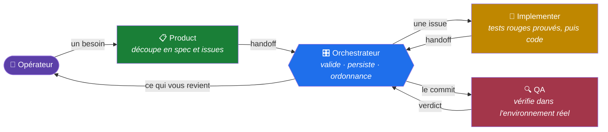
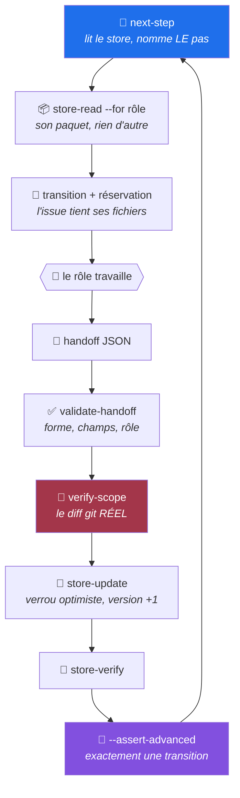
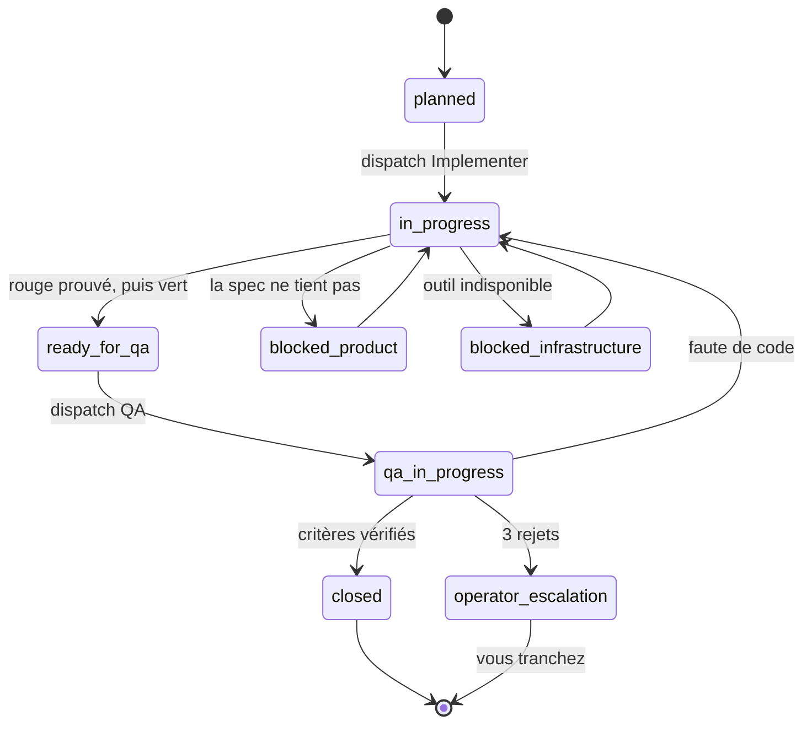
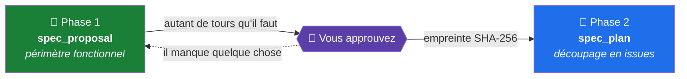

<div align="center">

# no-name-driven

**Un cadre pour faire écrire du logiciel par des agents — où chaque règle qui compte est adossée à une commande qui échoue.**

`Node` · `agnostique` · `132 tests sur lui-même` · `sans dépendance` · `MIT`

</div>

---

## 🎯 Le problème qu'il résout

Faire écrire du code par des agents marche. Le vérifier ne marche pas.

Un agent affirme avoir lancé les tests. Un autre déclare avoir couvert un critère. Un troisième reprend ces affirmations comme si c'étaient des faits, et construit dessus. **Personne n'a menti** — mais rien n'a été mesuré, et l'erreur voyage sans laisser de trace.

Ce cadre répond par une seule règle, appliquée partout, y compris à lui-même :

> ### ⚖️ Une consigne que rien ne fait mordre s'auto-annule.
>
> Un prompt qui demande de lire un fichier « s'il existe ». Un mécanisme documenté qu'aucun script ne vérifie. Personne n'échoue, personne ne signale, et la règle n'a jamais lieu.
>
> **Si une règle compte, elle a une porte ou un validateur derrière elle.**

---

## 🧭 Comment les agents travaillent

Quatre rôles se passent le travail. Aucun ne fait confiance au précédent.



| Rôle | Ce qu'il fait | Ce qu'il ne peut pas faire |
| :-- | :-- | :-- |
| 📋 **Product** | exigences, spec, découpage, PR | ni code, ni test, ni store |
| 🔨 **Implementer** | tests rouges **prouvés**, puis code | ni store, ni dépendance, ni configuration |
| 🔍 **QA** | vérification, revue, routage | **rien** — lecture seule |
| 🎛️ **Orchestrateur** | transitions, persistance, dispatch | ni code produit, ni test |

Ces interdictions ne sont pas des consignes : elles viennent d'une politique de fichiers **imposée par la plateforme**, et un handoff qui déclare un chemin hors de son périmètre est refusé.

### 🔒 Ce qui rend un cycle vérifiable



Deux points distinguent ce cycle d'un enchaînement de prompts :

🔎 **`verify-scope` confronte le handoff au `git diff` réel.** Un agent déclare ce qu'il veut ; ce qui est persisté est ce qui a été **mesuré**. La preuve du rouge est **rejouée** par un tiers contre le commit de test — le rouge est observé, jamais déclaré.

💾 **Un seul rôle écrit le store.** Les trois autres le lisent. C'est ce qui rend le verrou optimiste possible et la reprise après coupure calculable : l'orchestrateur fait **un pas**, puis s'arrête. Une interruption au milieu d'un cycle est indolore, parce que ce qui compte était déjà sur le disque.

### 🔄 Le cycle de vie d'une issue



Ces transitions vivent dans un fichier de règles, et **une transition absente de la liste est refusée à l'écriture**. Trois rejets de code sur la même issue mènent à l'escalade, jamais à un quatrième cycle.

---

## 🚀 Démarrer un projet

### 1️⃣ Poser le cadre

```bash
cd mon-projet
git clone https://github.com/HerbertCodex/no-name-driven.git agent-pipeline
rm -rf agent-pipeline/.git
```

> ⚠️ Le répertoire **doit** s'appeler `agent-pipeline/` — c'est le chemin que les prompts et les documents citent.

### 2️⃣ Décrire le produit, avant toute technique

Votre session vous pose **huit questions en langue ordinaire**. Deux comptent plus que les six autres :

> **B3** — Y a-t-il des situations où le système doit **refuser** quelque chose ?
> *Pas un champ obligatoire ni un format. Un vrai refus : « ce livre est déjà sorti », « ce compte n'a pas assez ».*
>
> **B4** — Ces refus, un professionnel du métier les comprendrait-il **sans qu'on parle informatique** ?

C'est ce qui détermine s'il y a un métier à protéger ou seulement un schéma à remplir. 💡 *Un système qui ne refuse jamais rien pour une raison venue du monde réel n'a pas de métier.*

### 3️⃣ Choisir comment ranger le code

```bash
node agent-pipeline/scripts/render-architecture.mjs archi.html backend [analyse.json]
```

Sans analyse : la page **pose les questions**. Avec l'analyse qu'en tire votre session : elle rend un **conseil argumenté**, chaque option avec son verdict *pour votre projet* et ses motifs cités.

Le catalogue est filtré par type de projet, et ce n'est pas cosmétique :

| Type | Options pertinentes |
| :-- | :-- |
| 🖥️ back-end | modules, couches, hexagonale, Clean, Onion |
| 🌐 interface web | modules, tranches, MVVM, MVI |
| 📱 mobile | modules, Clean, MVVM, MVI |
| 🔗 full-stack | *+ la question de la frontière entre les deux* |

Une interface web ne se voit pas proposer les ports : ils répondent à une contrainte qu'elle n'a pas.

> ### 🧠 Les trois principes que la page défend
>
> **N'allez pas au plus lourd par précaution.** C'est payer une assurance qu'on n'utilisera peut-être jamais, prélevée sur *chaque fichier écrit* pendant des années.
>
> **Partir simple garde les options ouvertes ; partir compliqué les ferme.** On durcit un dossier le jour où il l'a mérité. Personne, en revanche, ne retire des couches.
>
> **Vous n'avez pas à deviner l'avenir.** Chaque option donne les signes concrets qui diront qu'il est temps d'en changer.

### 4️⃣ Installer le pipeline

Donnez ceci à votre agent, en remplaçant `<stack>` :

```text
Ce dépôt contient un cadre d'agents dans agent-pipeline/. Il n'est pas encore
configuré pour ce projet, qui est en <stack>.

Lis agent-pipeline/docs/nouveau-profil.md et suis-le du début à la fin.

Le générateur de carte de projet est l'étape à ne pas survoler : tu dois en
écrire un pour cette stack. Un --check vert sur une carte vide est vert.

Ne me rends la main qu'après avoir répondu aux sept questions du point de
contrôle final — chacune par une commande et sa sortie réelle, jamais par une
appréciation.

Deux choses restent à moi : installer une dépendance, et éditer
pipeline.config.json une fois le pipeline en service. Demande-les moi.
```

### 5️⃣ Vérifier avant de croire

```bash
node agent-pipeline/scripts/preflight.mjs
```

Il exécute chaque porte et sépare **trois cas que la CI confond** : verte, refusante, ou **injouable faute d'outil**. 🚨 Une porte qui échoue parce qu'elle a trouvé un secret et une porte qui échoue parce que son binaire n'existe pas se ressemblent dans un journal — et confondues, la seconde apprend à ignorer la première.

Puis les **sept questions**, où *« je pense que oui » est une réponse non* :

| # | Question |
| :-- | :-- |
| 1 | Les trois `--check` de cibles générées sortent-ils en 0 ? |
| 2 | Le générateur de carte cite-t-il **réellement** le code ? |
| 3 | ⭐ **Chaque porte a-t-elle échoué au moins une fois, sur une casse volontaire ?** |
| 4 | `preflight` confirme-t-il que chaque porte est exécutable ? |
| 5 | Les crochets git se déclenchent-ils ? |
| 6 | `store-verify` est-il vert ? |
| 7 | Chaque invariant du profil a-t-il une porte qui le fait échouer ? |

> 💥 La troisième est celle qu'on saute, et c'est celle qui compte. Vérifiez aussi que votre casse **casse vraiment** : un motif de remplacement qui ne trouve rien laisse la porte verte et ne prouve rien.

---

## 📐 Ce que le cadre exige de votre profil

`apply-profile` refuse une configuration dont une clé de `commands` manque. **Huit sont obligatoires** — dont `design_limits`, qui doit borner quatre choses :

| Borne | Ce qu'elle approxime |
| :-- | :-- |
| complexité cyclomatique | KISS, et un proxy de responsabilité unique |
| longueur d'une fonction | responsabilité unique |
| nombre de paramètres | ségrégation d'interface |
| profondeur d'imbrication | KISS |

L'outil est libre — `eslint`, `pylint --max-complexity`, `gocyclo`. Le cadre ne voit qu'une clé et un code de sortie.

> ⚠️ **Ce ne sont pas SOLID.** Ce sont des approximations mesurables de ce qu'il protège : une fonction de deux cents lignes viole presque toujours la responsabilité unique, l'inverse n'est pas vrai. Une porte imparfaite qui mord vaut mieux qu'un principe que personne ne vérifie.
>
> **Ouvert-fermé et Liskov ne sont pas approximables** et restent en revue humaine. Écrivez-le dans vos invariants plutôt que de laisser croire qu'ils sont couverts.

Trois exigences de forme, apprises en posant cette porte : **calibrez les seuils sur le code réel** avant de les figer · **séparez-la de la porte de style** · **exemptez les blocs de test** de la limite de longueur.

---

## ✍️ Écrire une spec, en deux phases



**Phase 1** ne porte **aucune issue** : les fonctionnalités en langue produit, ce que chacune apporte à une personne réelle, les règles métier, et **ce qu'on ne construit délibérément pas**.

**Phase 2** porte l'empreinte du document approuvé. 🔐 `validate-handoff` refuse un découpage dérivé d'autre chose — ou d'une proposition **modifiée après votre accord**.

Ce que le validateur refuse en phase 1 :

- ❌ une proposition sans périmètre fonctionnel
- ❌ une fonctionnalité sans règle métier
- ❌ un `out_of_scope` absent — *ce qui n'est pas nommé est supposé fait*
- ❌ un choix soumis sans alternative
- ❌ une proposition qui porte déjà des issues — *le découpage se paie après l'accord*
- ❌ tout tour au-delà du premier qui ne dit pas ce que vous avez demandé

✅ Un tour où il ne reste rien à trancher se **déclare** (`scope_final: true`) au lieu de s'inventer une question : *une porte qui force à fabriquer apprend à fabriquer.*

---

## 🛠️ Vivre avec

```bash
node agent-pipeline/scripts/next-step.mjs              # 📍 le pas suivant, calculé
node agent-pipeline/scripts/next-issues.mjs            # ⚡ ce qui peut partir en parallèle
node agent-pipeline/scripts/render-decisions.mjs q.html # ⚖️ ce qui attend votre décision
node agent-pipeline/scripts/architecture-drift.mjs g.json # 📐 quand la forme ne tient plus
node agent-pipeline/scripts/preflight.mjs              # 🚦 chaque porte est-elle jouable ?
node agent-pipeline/scripts/metrics.mjs                # 📊 débit et défauts échappés
node agent-pipeline/scripts/status.mjs                 # 👁️ vue d'ensemble
```

⚖️ **`render-decisions` est calculée, pas rédigée.** Une issue dont aucun rôle ne peut prendre le périmètre y figure *même si personne ne l'a signalée*.

📐 **`architecture-drift` se tait sur un projet jeune** — et l'annonce. Un détecteur qui crie sur trois modules apprend surtout à être ignoré.

---

## 🔑 Ce qui reste à vous, toujours

| | Pourquoi |
| :-- | :-- |
| 📦 **Installer une dépendance** | un agent qui peut ajouter un paquet peut contourner n'importe quelle contrainte en important une bibliothèque qui la contourne |
| ⚙️ **Éditer `pipeline.config.json`** | c'est le fichier qui définit les portes — qui peut les redéfinir peut les rendre vertes |
| 🔀 **Merger** | QA valide une issue ; elle ne garantit pas la composition entre issues |

---

## 📚 Par où entrer

| Vous êtes | Lisez |
| :-- | :-- |
| 👤 l'humain qui installe et fait tourner | **`docs/operateur.md`** |
| 🤖 l'agent qui configure le pipeline | **`docs/nouveau-profil.md`** |
| 🔬 curieux de la mécanique avant de vous engager | `docs/state-machine.md` |

`docs/operateur.md` est le seul document qui s'adresse à l'humain. Il donne les trois décisions qui ne partent jamais à un agent, et surtout ce qu'il faut configurer pour que les garanties écrites soient **réelles** — ⚠️ *les permissions de plateforme et les crochets git ne s'activent pas tout seuls.*

---

## 📦 Ce qu'il y a dans la boîte

| | |
| :-- | :-- |
| `scripts/` | 25 scripts, tous en Node, **sans aucune dépendance installée** |
| `prompts/` | les quatre rôles |
| `docs/` | dont **`nouveau-profil.md`** (portage) et **`operateur.md`** (manuel humain) |
| `templates/` | `AGENTS.md`, `CLAUDE.md`, le workflow CI |
| `skills/` | ce qui ne dépend d'aucune stack |
| `test/` | **132 tests** sur le cadre lui-même |
| `schemas/` | la forme des handoffs |

🛡️ Une **porte d'agnosticité** refuse qu'un couplage à une stack entre ici : aucun script n'invoque de lanceur de tâches, aucun n'importe un paquet installé, aucun n'écrit en dur un chemin que la configuration possède, et chaque étape CI du cadre s'exécute par `node` en direct.

### Prérequis

| | |
| :-- | :-- |
| **Node** | les scripts du cadre sont en `.mjs` |
| **git** | le pipeline travaille par branches et par commits |
| **le client de votre forge** | Product ouvre les pull requests |

Rien d'autre ne vient du cadre. Tout le reste vient de vos portes — et `preflight` est là pour que leurs outils manquants ne se déguisent pas en constats.

---

## ⚠️ Limites connues

Écrites plutôt que découvertes.

- **Les profils vivent côté projet.** Cloner ce dépôt n'apporte pas les portes d'une stack donnée : pour un second projet du même type, elles se réécrivent. Une réserve de profils partagés reste à concevoir.
- **Rien ne déclenche les pages de relecture.** Le cadre les produit et dit ce qu'un harnais capable doit en faire ; c'est la session qui doit y penser. *Une discipline, pas une porte — et par la doctrine ci-dessus, c'est une faiblesse assumée.*
- **Aucun étalon externe.** Le cadre mesure son propre débit et ses défauts échappés ; il ne prouve pas encore qu'il fait mieux qu'une session directe.
- Les exemples de certains skills de patrons sont à coloration JavaScript. Un biais de rédaction, pas un couplage.

---

## ✅ Vérifier le cadre lui-même

```bash
node --test "test/**/*.test.mjs"
```

**132 tests**, qui tournent sur un clone nu comme dans un projet installé. Ils couvrent le verrou optimiste et les transitions du store, les portes de validation des handoffs, l'échappement des pages rendues, le détecteur de dérive, et la porte d'agnosticité qui empêche un couplage de stack d'entrer ici.

Chacune de ces portes a été éprouvée par une **casse volontaire** vérifiée appliquée — un motif de remplacement qui ne trouve rien laisse la porte verte et ne prouve rien.

---

## 📄 Licence

MIT — voir [`LICENSE`](LICENSE). Copier `agent-pipeline/` dans un dépôt privé, commercial ou non, est l'usage prévu.

---

<div align="center">

**Le cadre juge, le projet exécute.**
*Il ne connaît ni votre langage, ni votre framework, ni votre gestionnaire de paquets.*

</div>
