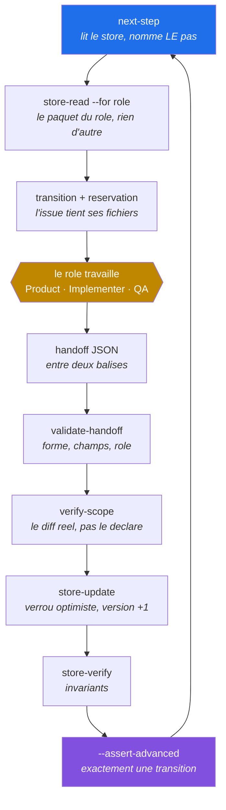
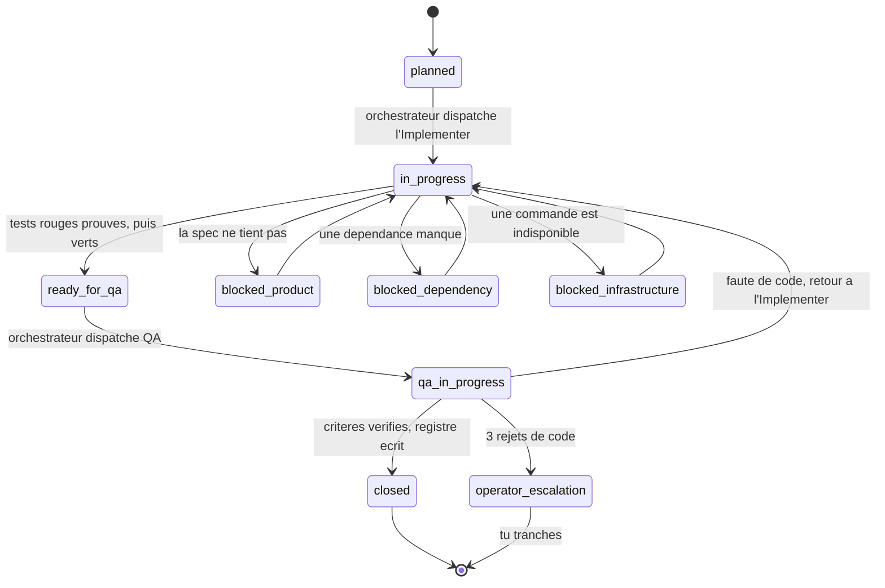
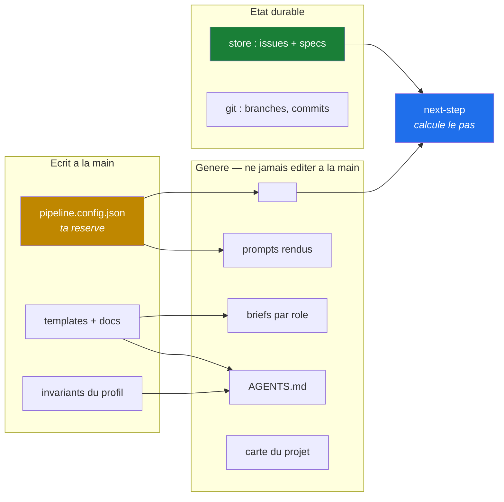

# Manuel de l'opérateur

Ce document s'adresse à **l'humain**. Tout le reste de `agent-pipeline/docs/` parle aux agents ; ici on parle de ce que la machine ne peut pas faire à ta place, et de ce qui ne fonctionnera pas si tu ne le fais pas.

## Ce que le pipeline est, en une phrase

Quatre rôles se passent le travail — Product découpe, Implementer épingle les critères en tests rouges puis implémente, QA vérifie, l'Orchestrateur valide et persiste — et l'état durable vit dans un store sur disque, pas dans la mémoire d'un agent.

Tu n'es pas un utilisateur de ce système : tu en es une pièce. Trois décisions ne partent jamais à un agent.

## Comment ça marche

### Un pas, et un seul

L'orchestrateur n'est pas une boucle qui tient une fonctionnalité du début à la fin. Il est rappelé **une fois par transition**, relit l'état sur le disque, fait un pas, et s'arrête. C'est ce qui rend une coupure indolore : ce qui compte est déjà écrit quand elle arrive.



Deux points de ce cycle méritent d'être compris, parce que ce sont eux qui distinguent ce pipeline d'un enchaînement de prompts.

**`verify-scope` confronte le handoff au diff git réel.** Un agent peut déclarer ce qu'il veut ; ce qui est persisté est ce qui a été mesuré. Pour un handoff de passage en QA, la preuve du rouge est **rejouée** contre le commit de test : le rouge doit être observé, jamais déclaré.

**Un seul rôle écrit le store.** Product, Implementer et QA le lisent et ne l'écrivent jamais. C'est ce qui rend le verrou optimiste possible et la reprise après coupure calculable.

### Les états d'une issue



Ces transitions ne sont pas décoratives : elles vivent dans le fichier `rules_path`, et une transition absente de cette liste est refusée à l'écriture. **Trois rejets de code sur la même issue mènent à l'escalade, jamais à un quatrième cycle.**

### Où vit la vérité



La règle qui découle du schéma : **ce qui est généré se régénère, jamais s'édite.** Trois `--check` refusent une cible désynchronisée, et c'est le rôle des crochets git de les déclencher.

## Les trois choses qui restent à toi

**Installer une dépendance.** Un agent qui peut ajouter un paquet peut contourner n'importe quelle contrainte en important une bibliothèque qui la contourne. Si un rôle en a besoin, il s'arrête et te le demande.

**Éditer `pipeline.config.json`.** C'est le fichier qui définit les portes. Un agent qui peut les redéfinir peut les rendre vertes. Exception unique : l'installation initiale dans un projet neuf, où l'agent écrit la configuration parce que c'est l'objet de la tâche.

**Merger.** QA valide une issue ; elle ne garantit pas la composition entre issues, et personne d'autre que toi ne regarde le résultat d'un merge.

## Prérequis machine

Trois prérequis viennent du pipeline lui-même, quelle que soit la stack du projet :

| Prérequis | Pourquoi |
| --- | --- |
| Node | les scripts du core sont en `.mjs` |
| git | le pipeline travaille par branches et par commits |
| Le client de ta forge | Product ouvre les pull requests |

### Ce que le framework attend de ton harnais d'agents

`agent-pipeline/` est le framework ; `pipeline/` en est la conséquence dans ce dépôt. Le framework ne suppose donc **rien** de l'outil qui exécute les agents, au-delà de Node, git et le client de forge ci-dessus. Il ne suppose ni qu'un harnais sait héberger une page, ni qu'un navigateur existe, ni qu'un lien peut être rendu à l'humain.

La règle qui en découle vaut pour toute sortie destinée à un humain : **le framework produit un fichier autonome et nomme ce qu'un harnais capable doit en faire.** La capacité appartient à l'outil, jamais au pipeline. Les deux renderers impriment donc, après le chemin écrit, la ligne qui dit quoi en faire — publier si le harnais sait héberger, rendre le chemin sinon. Elle est imprimée là où le pilote regarde déjà, la sortie de la commande, plutôt qu'enfouie dans un document qu'il peut ne pas avoir lu.

Corollaire à connaître : un harnais qui ne sait pas publier ne dégrade **rien** de garanti. Les pages s'ouvrent seules, sans réseau ni dépendance. Ce qui se perd est le confort d'un lien, pas une preuve.

Les autres viennent de **ta** configuration, et c'est là qu'est le piège.

Ouvre `commands` dans `pipeline.config.json` et relève tout ce qui n'est pas lancé par le gestionnaire de paquets de ton écosystème. Ces binaires-là ne s'installent pas avec les dépendances du projet : personne ne les apportera à ta place. **L'analyse de secrets est le cas le plus fréquent** — son outil est presque toujours un binaire externe.

Un prérequis manquant ne se manifeste pas par une absence, mais par une porte qui **échoue au lieu de protéger**. Et une porte qui échoue toujours finit par être contournée ou ignorée, ce qui est pire que son absence : le dépôt affirme une protection que personne n'exerce.

Vérifie-les un par un, en lançant la commande de la config, pas en supposant.

## Ce que tu dois configurer pour que les garanties soient réelles

C'est la section qui compte. Le pipeline **décrit** plus de mécanismes qu'un dépôt n'en **exécute** par défaut. Quatre d'entre eux ne s'activent que si tu les installes, et chacun est silencieux tant que tu ne le fais pas.

### Les permissions de la plateforme

`file_policy` interdit à chaque rôle d'écrire hors de son périmètre : l'Implementer ne touche ni au store, ni à la configuration, ni au core du pipeline. Cette politique est injectée dans le fichier `rules_path` et répétée dans chaque prompt.

**Une interdiction écrite dans un prompt n'est pas une barrière de sécurité.** C'est écrit noir sur blanc dans `AGENTS.md` §3, et ça vaut pour celle-ci : si ta plateforme d'agents n'impose pas ces refus elle-même, ils reposent sur la bonne volonté du modèle.

Vérifie que ta plateforme porte bien une politique de refus sur les chemins de `file_policy`, et pas seulement la liste d'outils accordés à chaque rôle. Accorder l'outil d'écriture et espérer que le prompt limite la cible, ce n'est pas une permission, c'est une consigne.

### Les crochets git

`pre-commit` lance le format, `lint` et `secrets_scan`. `pre-push` lance `check`, `lint` et les trois `--check` de cibles générées.

```
ls .git/hooks/ | grep -v sample
```

Si cette commande ne rend rien, **aucun crochet ne tourne** — quoi qu'en disent les documents. Une cible générée peut alors se désynchroniser, être poussée et mergée sans que rien ne le signale.

### La CI, ou son absence assumée

Avec `ci.provider` autre que `"none"`, un run vert sur le SHA exact vaut preuve et QA le lit au lieu de relancer. Avec `"none"`, il n'y a pas de run : **QA exécute réellement chaque porte**, et c'est la batterie locale complète qui fait foi à la clôture.

Les deux choix sont valides. Ce qui ne l'est pas, c'est de croire à un run qui n'existe pas.

### Les skills, que tu relis une fois et une seule

`apply-profile` installe dans `skills_dir` les skills de `agent-pipeline/skills/` et ceux du profil. **Un skill injecte des instructions dans tes agents, au-dessus d'`AGENTS.md` dans l'ordre de priorité** : c'est la surface la plus puissante du dépôt, et la seule que tu doives lire toi-même avant de la laisser tourner.

```
node agent-pipeline/scripts/apply-profile.mjs --check
```

Cette commande refuse une copie installée qui a dérivé de sa source — fichier modifié à la main, fichier supprimé, fichier étranger déposé. C'est ce qui rend la relecture durable : tu lis la source une fois, et toute divergence ultérieure est signalée avant qu'un agent ne la lise.

Ce que le pipeline ne fait pas, et qu'il faut savoir : **rien ne vérifie qu'un agent a chargé le skill qu'il aurait dû charger.** Un skill est un conseil. Si une règle compte vraiment, elle devient une commande de `commands` — voir `skills.md`.

## Le miroir sudocode

Le pipeline peut refléter l'état de ses issues vers [sudocode](https://github.com/sudocode-ai/sudocode), un système léger d'orchestration d'agents qui s'installe dans le dépôt et offre une visualisation et une interface de suivi.

**L'intégration est optionnelle et pilotée par la configuration.** Le bloc `sudocode` de `pipeline.config.json` porte `enabled` et une table `status_map` qui traduit chaque phase du pipeline en statut sudocode. Quand `enabled` n'est pas vrai, rien n'est écrit et le pipeline fonctionne exactement pareil.

Ce que tu dois comprendre du partage :

- **Le pipeline reste propriétaire de son état.** La phase, la version, les réservations et le registre de vérification vivent dans `pipeline_state`, et c'est `store-update` qui les écrit, sous verrou optimiste.
- **Le statut sudocode est un reflet, jamais une source.** Il est recalculé depuis la phase à chaque persistance. L'éditer à la main ne change rien au pipeline et sera écrasé au pas suivant.
- **Le store du pipeline vit dans `store_dir`**, qui pointe par convention vers le répertoire de sudocode pour que ses outils y voient le travail. Les deux cohabitent dans le même dossier sans que l'un dépende de l'autre.

Les commandes d'installation dépendent de ton écosystème : elles sont dans le `README` du dépôt, pas ici — ce document voyage avec le pipeline et ne suppose aucun gestionnaire de paquets.

## Faire travailler le pipeline

Formule ton besoin en langage naturel. La session te demandera d'abord **pipeline ou direct** — et c'est une vraie question, pas une politesse.

Le **direct** est légitime pour un correctif d'outillage, une question, une exploration. Il perd quatre choses, et il vaut mieux les choisir que les découvrir : aucune trace dans le store, pas de découpage Product (la session décide seule du contrat puis écrit les tests qui le valident, donc son implémentation est jugée contre elle-même), pas de QA indépendante, et ni `verify-scope` ni verrou optimiste ni registre de vérification.

Le **pipeline** est plus lent et laisse une trace opposable.

## Relire une spec avant de l'approuver

Une proposition de spec est un JSON de plusieurs dizaines de kilo-octets. Personne ne valide un périmètre en lisant du JSON dans un terminal, et un opérateur qui ne relit pas approuve tout — donc la phase 1 ne sert plus à rien et on revient à découvrir le produit dans le code.

À chaque tour, avant de demander l'arbitrage :

```
node agent-pipeline/scripts/render-proposal.mjs <proposition.json> <sortie.html>
```

La page rendue ouvre sur **ce qui attend l'arbitrage** — question, recommandation, autres options — puis déroule le périmètre : fonctionnalités et règles numérotées, exclusions, engagements de conception et de PR, découpage envisagé. Elle affiche le tour, le décompte de questions ouvertes et, quand la proposition en porte une, l'empreinte qui liera la phase 2.

Trois propriétés qui ne sont pas décoratives. Le **texte est repris verbatim**, jamais reformulé : une relecture obligeante creuserait un écart entre ce que l'opérateur lit et ce que l'empreinte fige. Le rendu est **déterministe**, sans décision de mise en forme au moment de publier : deux tours successifs se comparent à l'œil parce que seule leur substance change. Et le contenu est **échappé** : une proposition est écrite par un agent, donc c'est une donnée, jamais du balisage — sans quoi une spec pourrait injecter du script dans la page qui sert à l'approuver.

Le script refuse tout mode autre que `spec_proposal`. La session publie ensuite la page et t'en donne le lien.

## Voir ce qui attend ta décision

```
node agent-pipeline/scripts/render-decisions.mjs <sortie.html> [proposition.json]
```

Cette page-là n'est pas rédigée, elle est **calculée** depuis le store et `file_policy`. Elle rassemble ce qui ne peut pas avancer sans toi :

- les **questions de spec** ouvertes du tour en cours, avec la recommandation et les autres options, quand une proposition est jointe ;
- les issues **arrêtées** en phase de blocage, qui tiennent leurs réservations tant qu'elles y restent ;
- les issues **qu'aucun agent ne peut prendre** — tout leur périmètre est hors de la politique de fichiers de chaque rôle qui écrit. C'est du travail opérateur, qu'elles le disent ou non, et `next-issues` les présente pourtant comme dispatchables parce qu'il calcule la disjonction des réservations sans lire `file_policy`.

Le cas le plus traître est la troisième catégorie quand le périmètre est **partagé** : une issue qui touche à la fois un document de stack et les briefs générés n'est prenable par aucun rôle unique, alors que chaque moitié l'est par quelqu'un. Personne ne le remarque en lisant, et le calcul le voit.

## Les commandes que tu liras

Les scripts du core s'appellent directement, dans tous les projets :

```
node agent-pipeline/scripts/next-step.mjs      # le pas suivant : une issue, un acteur, une action
node agent-pipeline/scripts/next-issues.mjs    # les issues dispatchables en parallele maintenant
node agent-pipeline/scripts/metrics.mjs        # debit et echappees
node agent-pipeline/scripts/store-verify.mjs   # invariants du store
node agent-pipeline/scripts/render-proposal.mjs <proposition.json> <sortie.html>   # relire une spec avant de l'approuver
node agent-pipeline/scripts/render-decisions.mjs <sortie.html> [proposition.json]  # ce qui attend ta decision
node --test "agent-pipeline/test/**/*.test.mjs"                                   # prouver le core lui-meme
```

La plupart des projets les aliasent dans leur outil de tâches — regarde le `README` du dépôt pour la forme locale.

Les portes de qualité, elles, ne s'appellent jamais par leur commande mais **par leur clé** : `check`, `lint`, `test_unit`. La commande derrière la clé est dans `pipeline.config.json` et change avec la stack ; la clé, non. C'est ce qui permet aux documents et aux prompts de désigner une porte sans connaître l'outil qui la rend.

## Lire les mesures sans se mentir

**Zéro échappée ne veut rien dire si le compteur de découvertes est aussi à zéro.** Ça dit que le mécanisme n'a pas servi, pas qu'aucun défaut n'est passé. `pipeline:metrics` te le dit lui-même quand c'est le cas — lis cette phrase au lieu de lire le chiffre.

**Une porte verte ne prouve rien tant que tu ne l'as pas vue échouer.** Une porte peut être verte parce qu'elle ne mesure rien : une couverture qui collecte sur du code qu'elle n'exécute pas, une analyse de mutation qui réutilise son cache, une carte de projet qui ne collecte pas les bons fichiers. Les trois se sont produites.

**La durée est l'indicateur le plus bruyant et le plus séduisant.** Ceux qui comptent sont les échappées, les cycles par issue, et les critères vérifiés au premier passage. Un run deux fois plus rapide qui laisse échapper un défaut est un run pire.

## Le point de contrôle de ton installation

Réponds par une commande, jamais par une impression :

1. Chaque binaire exigé par `commands` répond-il, et le client de ta forge est-il authentifié ?
2. `ls .git/hooks/ | grep -v sample` rend-il quelque chose ?
3. Ta plateforme refuse-t-elle réellement une écriture hors `file_policy` ?
4. `apply-profile --check`, `sync-briefs --check` et la carte `--check` sortent-ils tous en 0 ?
5. As-tu vu chaque porte échouer au moins une fois, sur une casse volontaire ?
6. `store-verify` est-il vert ?

Une réponse « je crois que oui » est une réponse non. C'est la seule règle de ce document qui vaut pour toutes les autres.

## Installer le pipeline dans un projet neuf

Ce document décrit un pipeline déjà installé. Pour l'installer ailleurs, la marche à suivre est dans `nouveau-profil.md`, et elle s'adresse à l'agent qui fait le travail — ton rôle s'y limite à fournir les prérequis ci-dessus et à relire ce qu'il a écrit.
